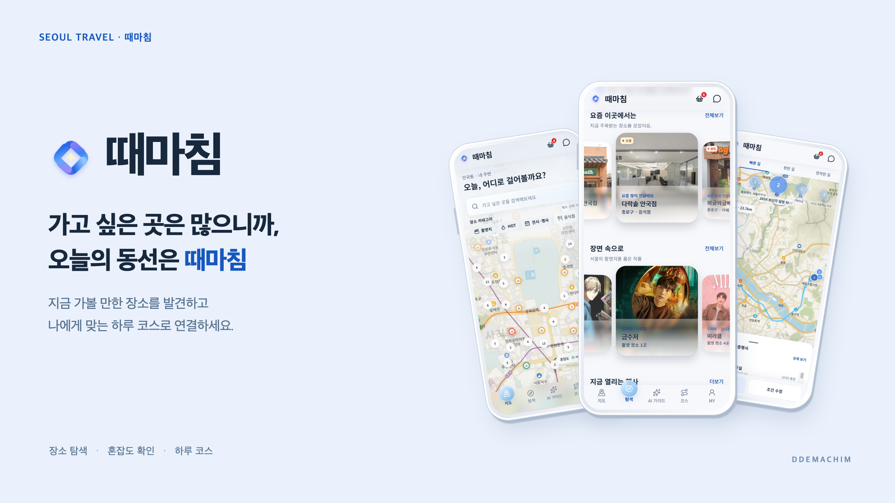
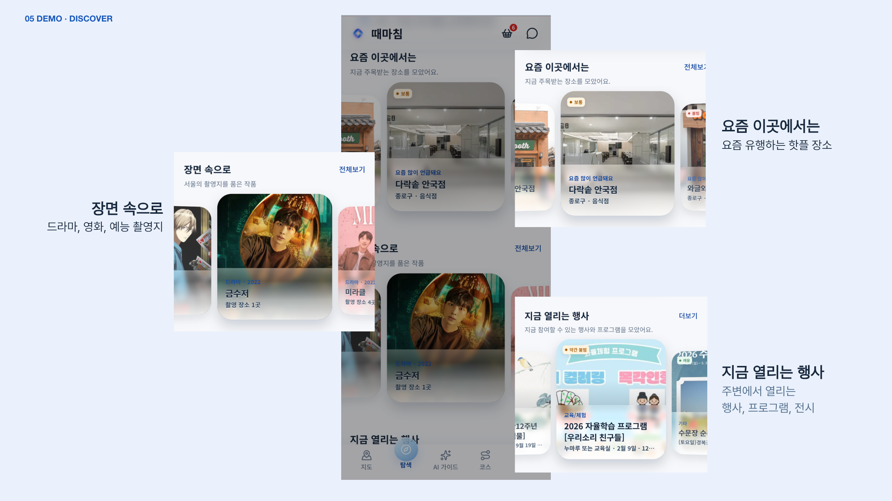
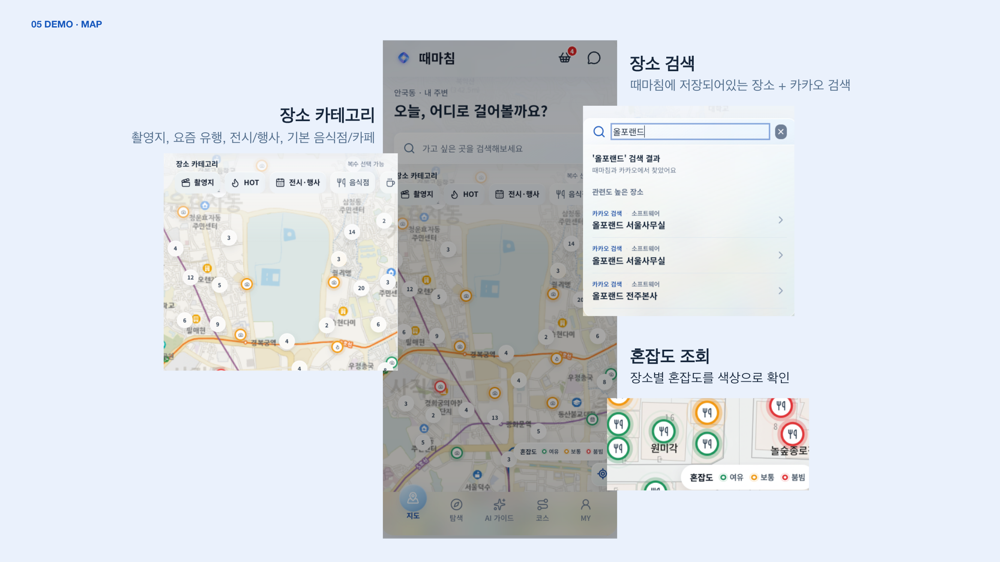
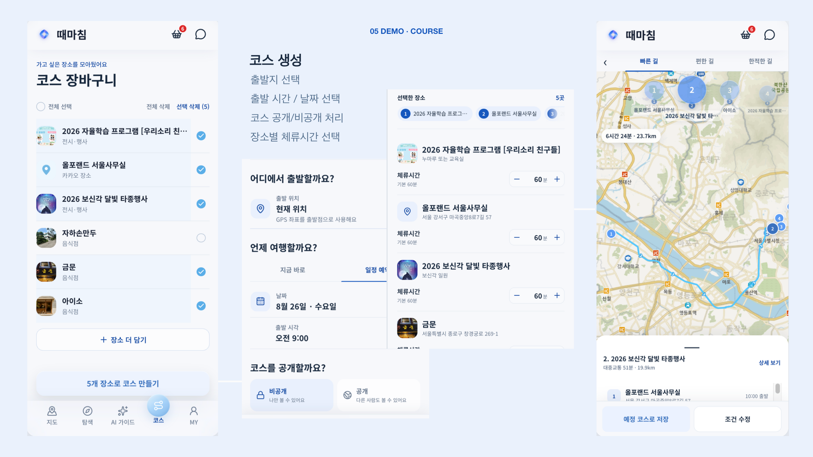
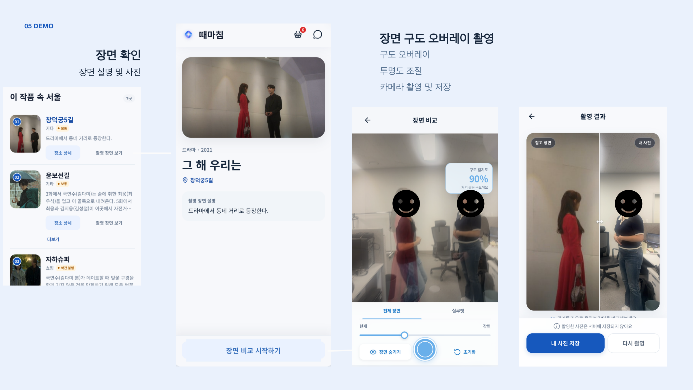
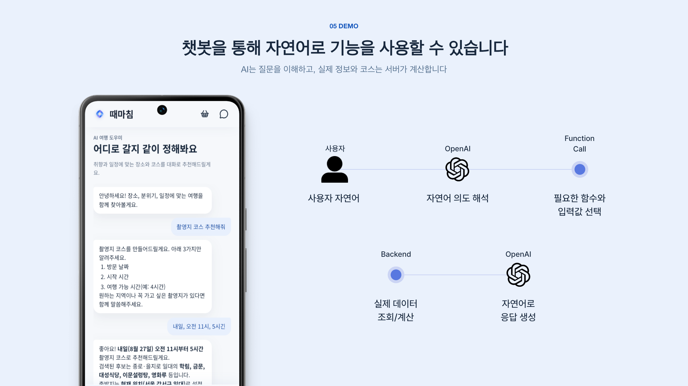
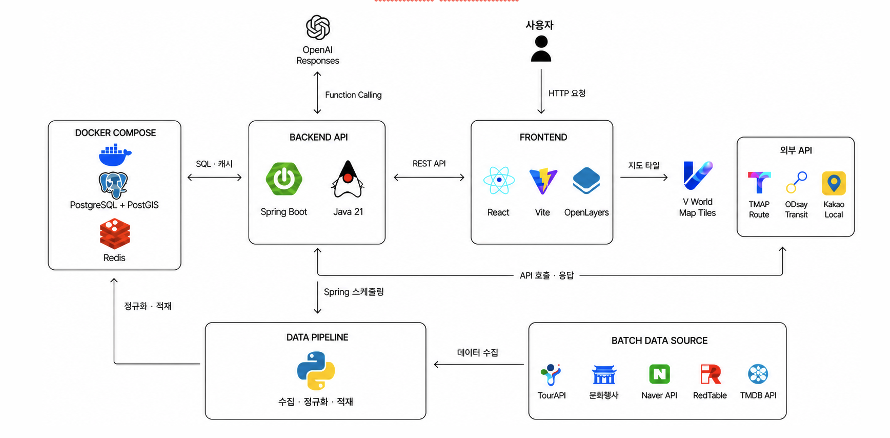

# 때마침



### 가고 싶은 곳은 많으니까, 오늘의 동선은 때마침

**지금 가볼 이유가 있는 장소를 발견하고, 방문 가능한 하루 코스로 연결하는 서울 여행 서비스입니다.**

요즘 뜨는 카페, 지금 열리는 전시, 좋아하는 작품의 촬영지까지. 가고 싶은 장소를 모으면 운영시간·체류시간·이동시간을 고려해 방문 순서를 만들고, 코스를 따라 이동할 수 있습니다.

> 올포랜드 일학습병행 개인 프로젝트 · 기획 및 개발: 유진  
> 서울 종로구 중심의 모바일 웹 MVP

## 목차

- [기획 배경](#기획-배경)
- [주요 기능](#주요-기능)
- [핵심 구현 로직](#핵심-구현-로직)
- [시스템 구성](#시스템-구성)
- [구현 범위와 확장 계획](#구현-범위와-확장-계획)
- [실행 및 개발 문서](#실행-및-개발-문서)

## 기획 배경

### 촬영지를 발견하는 경험에서, 하루를 계획하는 서비스로

때마침은 영화·드라마 속 장소를 찾아가고, 좋아하는 장면을 직접 따라 찍는 아이디어에서 출발했습니다. 이후 촬영지를 **장소를 방문하고 싶은 여러 이유 중 하나**로 확장했습니다. 카페의 최근 관심도, 기간이 정해진 행사, 작품 속 장면처럼 서로 다른 방문 동기를 한곳에서 탐색할 수 있도록 구성했습니다.

장소를 발견한 뒤에도 여행 준비는 남습니다. 지도에서 위치를 찾고, 운영시간을 확인하고, 장소를 저장해도 방문 순서는 다시 직접 정해야 합니다.

**“가고 싶은 곳은 정했는데, 오늘 어떤 순서로 가야 하지?”**

때마침은 이 질문에 집중합니다.

| 단계 | 사용자가 하려는 일 | 때마침의 역할 |
| --- | --- | --- |
| 발견 · DISCOVER | 지금 가볼 만한 장소 찾기 | 트렌드 장소·행사·촬영지·주변 장소 탐색 |
| 계획 · PLAN | 원하는 장소를 하루 일정으로 만들기 | 여행 조건을 반영한 방문 순서와 경로 비교 |
| 이동 · MOVE | 계획한 코스를 실제로 따라가기 | 현재 위치 기반 이동 안내와 도착 감지 |

```text
장소 발견 → 상세 정보 확인 → 코스에 담기 → 여행 조건 설정
         → 코스 비교·선택 → 이동 안내 → 현장 촬영·방문 기록
```

## 주요 기능

*아래 이미지는 실제 앱 시연 화면과 발표자료를 활용한 소개 이미지입니다. 표시된 장소·일정·점수는 시연 당시의 예시입니다.*

### 1. 지금 가볼 이유가 있는 장소 탐색



- **요즘 이곳에서는**: 블로그 언급과 검색 관심도를 바탕으로 주목받는 장소를 살펴봅니다.
- **장면 속으로**: 영화·드라마·예능의 작품 정보와 촬영지를 연결해 탐색합니다.
- **지금 열리는 행사**: 진행 중이거나 예정된 행사·전시·프로그램을 확인합니다.
- 마음에 드는 장소는 상세 정보를 확인하고 코스에 담을 수 있습니다.

### 2. 지도에서 주변 장소와 혼잡도 확인



- 촬영지, 요즘 주목받는 장소, 전시·행사, 음식점·카페 등으로 장소를 필터링합니다.
- 때마침에 등록된 장소와 **Kakao Local 검색 결과**에서 원하는 장소를 찾습니다.
- 지도 마커에서 위치와 장소 정보를 확인하고, 현재 위치 기준 경로 조회로 연결합니다.
- 혼잡도를 **여유·보통·붐빔** 색상으로 구분합니다.

> 현재 혼잡도는 **종로구 50m 격자와 30분 시간대에 기반한 모의 데이터(MOCK)**입니다. 실제 유동인구를 측정하거나 예측한 정보는 아닙니다.

### 3. 원하는 장소로 하루 코스 만들기



코스 장바구니에 장소를 담고 출발지, 출발 날짜·시간, 장소별 체류시간을 설정합니다. 생성된 코스는 비교·선택한 뒤 저장하고, 공개 여부를 정할 수 있습니다.

| 코스 | 우선하는 기준 | 계산 방식 |
| --- | --- | --- |
| **빠른 길 · FAST** | 이동시간 | 방문 가능한 순서를 찾고 이동시간을 줄입니다. |
| **편한 길 · EASY** | 도보 경사 부담 | FAST의 방문 순서를 유지하며 비교 가능한 도보 경로의 경사를 평가합니다. |
| **한적한 길 · QUIET** | 도착 시각의 혼잡도 | 이동시간에 목적지 혼잡도 비용을 더해 방문 순서를 계산합니다. |

일정을 만들 수 없을 때는 장소를 임의로 빼지 않고 실패 이유와 조정안을 제공합니다. 사용자는 조건을 바꾸거나 구간별 대안 경로를 선택해 일정을 조정할 수 있습니다.

### 4. 코스를 따라가는 이동 안내

- 현재 위치, 다음 목적지, 남은 일정을 확인합니다.
- 위치가 바뀌면 진행 상황과 다음 이동 안내를 갱신합니다.
- 목적지 반경에 들어오면 도착을 감지해 다음 일정으로 연결합니다.

### 5. 장면 따라 찍기



촬영지의 작품·장면 정보를 확인한 뒤, 참고 장면을 카메라 화면 위에 겹쳐 구도를 맞춥니다. 전체 장면과 실루엣을 참고하고, 투명도를 조절하며 촬영할 수 있습니다. 촬영 결과는 참고 장면과 비교하고 저장하거나 공유합니다.

### 6. 대화형 AI 가이드



“경복궁 주변 카페 찾아줘”, “촬영지 코스 추천해줘”처럼 자연어로 장소 검색·혼잡도 조회·코스 생성을 요청합니다.

AI는 요청을 해석하고 필요한 함수를 선택합니다. **실제 장소 조회와 코스 계산은 서버가 수행**하며, 그 결과를 대화와 추천 장소·코스 정보로 전달합니다. 코스 생성에 필요한 날짜, 출발 시각·위치, 사용 가능 시간이 없으면 부족한 조건을 질문합니다.

## 핵심 구현 로직

### 1. 여러 데이터 소스를 하나의 장소로 연결

장소마다 필요한 정보가 다르기 때문에 단일 API 대신 여러 데이터 소스를 통합했습니다.

| 데이터 소스 | 활용 정보 |
| --- | --- |
| RedTable | 음식점·카페의 기본 정보, 운영시간, 이미지 |
| TourAPI | 관광지·문화시설 및 행사 정보 |
| 서울시 관광명소·문화행사 데이터 | 지역 명소, 행사 일정과 장소 |
| 한국문화정보원 촬영지 데이터 | 촬영 장소와 작품의 연결 |
| TMDB | 작품 포스터·줄거리·출연진 등 작품 정보 |
| Naver Blog·검색 관심도 | 장소 언급과 관심도 변화 |
| Kakao Local | 장소·주소 검색, 좌표 보완 |

```text
외부 API·CSV
    ↓
원본 보존 → 필드·이름·주소·운영시간 정규화
    ↓
기존 장소 후보 검색 → 이름·주소·좌표 검증 → 통합 Place
    ↓
행사·작품·촬영지·트렌드 정보 연결
```

- 원본 응답을 보존해 변환 과정을 추적하고 재처리할 수 있도록 합니다.
- 소스별 식별자로 재수집 데이터를 구분해 중복 생성을 줄입니다.
- 장소 매칭에는 이름·주소와 함께 PostGIS의 `ST_DistanceSphere` 거리 계산을 사용합니다.
- 애매한 후보는 검토 대상으로 남기고, 확정할 수 없는 값을 임의로 채우지 않습니다.
- 기간이 있는 행사는 상시 장소인 `place`와 분리된 `event`로 관리합니다.

구체적인 소스별 매칭 기준과 데이터 구조는 [데이터 파이프라인 문서](data-pipeline/README.md)에 정리했습니다.

### 2. 반복 언급과 검색 관심도로 트렌드 확인

지역명과 장소 유형을 조합해 블로그 게시글을 수집하고, 광고·협찬 의심 게시글과 범위 밖 장소를 제외합니다. 게시글의 지도 정보와 주소를 활용해 언급된 장소를 실제 장소 데이터에 연결합니다.

관심도 판단에는 다음 근거를 함께 사용합니다.

- 최근 게시글 수와 고유 작성자 수
- 여러 수집일에 걸친 반복 언급
- 검색 관심도의 기준 기간 대비 변화

발표자료에서 사용한 월간 비교 방식은 다음과 같습니다.

```text
검색 관심도 비율 = 이번 달 일평균 관심도 / 직전 3개월 일평균 관심도
```

예를 들어 24 ÷ 2 = 12배는 기준 기간 대비 상대 관심도의 상승을 뜻합니다. 절대 방문자 수나 실제 인기도를 직접 측정한 값은 아닙니다. 수집 방식과 판정 기준은 개선 과정에서 바뀌었으므로, 발표 당시의 수집 건수를 현재 운영 지표로 사용하지 않습니다.

수집·정제·판정 기준의 변경 과정은 [트렌드 수집 이력](data-pipeline/docs/place-trend-collection-history.md)에서 확인할 수 있습니다.

### 3. FAST: 방문 가능성을 먼저 검증하는 코스 계산

**가까운 장소라도 체류를 마치기 전에 문을 닫는다면 유효한 일정이 아닙니다.**

일반적인 운영시간 검증은 다음 순서로 진행합니다.

```text
방문 시작 = max(이전 장소 출발 + 이동시간, 영업 시작)
방문 종료 = 방문 시작 + 체류시간
방문 종료 ≤ 영업 종료인지 확인
```

현재 13:00이고 각 장소에서 60분 머무른다고 가정하면:

| 후보 | 이동시간 | 영업 종료 | 체류 종료 | 판단 |
| --- | --- | --- | --- | --- |
| A | 10분 | 17:00 | 14:10 | 방문 가능 |
| B | 5분 | 13:30 | 14:05 | 해당 시점에 방문 불가 |

B가 더 가까워도 A를 먼저 선택할 수 있는 이유입니다. 입력된 입장·도착 제한 시각과 전체 이용 가능 시간도 별도로 검증합니다.

#### 순서를 찾는 과정

1. **초기 순서 생성**: 방문 가능한 후보 중 이동시간이 짧은 장소를 차례로 선택합니다.
2. **전체 일정 검증**: 출발지부터 마지막 장소까지 이동·대기·체류시간을 계산합니다.
3. **초기 순서가 실패하면 Beam Search**: 방문 가능한 부분 순서를 확장하고, 단계마다 이동시간이 짧은 상위 **16개**를 유지해 다른 순서를 찾습니다.
4. **초기 순서가 유효하면 2-opt 개선**: 연속된 방문 구간을 뒤집고 전체 일정을 다시 검증해, 유효하면서 이동시간이 짧아지는 변경을 채택합니다.

```text
초기 순서: A → B → C → D
구간 반전: A → C → B → D
          모든 장소의 방문 가능성 재검사
```

유효한 도보 경로가 **20분 이내**이면 도보를 우선 사용하고, 그 외에는 대중교통을 조회합니다. 대중교통을 사용할 수 없으면 유효한 도보 경로를 대안으로 사용합니다. 조회한 구간 정보는 같은 계산 과정에서 재사용합니다.

이 방식은 탐색 비용을 제한한 휴리스틱입니다. 모든 경우의 수를 검사하지 않으므로 **전역 최단 경로나 가능한 모든 일정의 발견을 보장하지 않습니다.**

구현: [CourseFastPlanner.java](BE/src/main/java/com/ddemachim/server/domain/course/service/CourseFastPlanner.java)

### 4. EASY: 같은 방문 순서에서 도보 부담 줄이기

EASY는 FAST의 방문 순서를 유지하고, 선택된 도보 경로 중 20분 이내이며 비교에 필요한 구간 정보가 있는 대상을 평가합니다. **DEM(수치표고모델)**은 지점별 지면 높이를 담은 데이터로, 도보 경로의 오르막 부담을 평가하는 데 사용합니다.

고도 정보를 사용할 수 있는 후보는 다음 순서로 비교합니다.

1. 급경사 오르막 구간의 거리
2. 누적 상승고도
3. 이동시간과 도보 거리

고도 정보를 얻을 수 없는 경우에는 이동시간·거리 기준으로 비교하고, 원래 경로가 더 나쁘지 않으면 유지합니다. 따라서 모든 구간에서 평탄한 길을 보장하는 기능은 아닙니다.

구현: [CourseEasyWalkSelector.java](BE/src/main/java/com/ddemachim/server/domain/course/service/CourseEasyWalkSelector.java)

### 5. QUIET와 혼잡도 캐시

QUIET는 각 후보의 **도착 예정 시각**에 해당하는 목적지 혼잡도를 조회합니다. 방문 가능성을 검증한 후보에 아래 비용을 적용해 다음 장소를 선택합니다.

```text
후보 비용 = 이동시간(초) + 혼잡도 등급별 패널티(분) × 60
```

혼잡도 패널티는 순서를 비교하기 위한 비용이며, 실제 이동시간에 사람이 몰리는 시간을 더했다는 뜻은 아닙니다.

현재 혼잡도 제공 흐름은 다음과 같습니다.

```text
장소 좌표 → 종로구 50m 격자 식별
요청 시각 → 서울 시간 기준 30분 슬롯으로 정규화
         → 격자·날짜·시간 슬롯에 해당하는 Redis 캐시 조회
         → 없으면 동일 입력에 같은 점수가 나오는 모의 점수 생성
         → 기본 24시간 캐싱 → 지도 표시·QUIET 계산에 사용
```

다음 30분 슬롯에서는 다른 캐시 키를 사용합니다. Redis 조회에 실패하면 같은 입력으로 점수를 생성하는 대체 경로를 사용합니다. 캐시 유지시간 24시간과 혼잡도 시간 단위 30분은 서로 다른 설정입니다.

구현: [CourseQuietPlanner.java](BE/src/main/java/com/ddemachim/server/domain/course/service/CourseQuietPlanner.java), [혼잡도 서비스](BE/src/main/java/com/ddemachim/server/domain/crowding/service)

### 6. 챗봇: 자연어 요청을 실제 서비스 기능으로 연결

```text
사용자 요청
    ↓
OpenAI: 의도 해석 · 함수와 입력값 선택
    ↓
서버: 입력 확인 · 장소 검색 / 혼잡도 조회 / 코스 계산
    ↓
함수 실행 결과 반환
    ↓
OpenAI: 결과를 자연어로 설명
    ↓
응답 + 추천 장소 ID + 코스 제안
```

- 장소 추천에는 서버 검색 결과를 사용합니다.
- “경복궁 주변”처럼 기준 장소를 지정하면 해당 장소를 해석한 뒤 주변의 저장 장소를 찾습니다.
- 코스 후보는 조회 결과의 실제 장소 ID로 구성하고, 최종 방문 순서는 서버의 코스 계산에 맡깁니다.
- 코스 생성에 필요한 정보가 부족하면 빠진 조건을 질문합니다.

OpenAI Responses API의 함수 호출과 Spring AI MCP 도구 구성을 사용합니다. AI가 내용을 설명하는 역할과 서버가 데이터를 조회·계산하는 역할을 분리했습니다.

구현: [OpenAiResponsesClient.java](BE/src/main/java/com/ddemachim/server/domain/aiguide/service/OpenAiResponsesClient.java), [DdemachimMcpTools.java](BE/src/main/java/com/ddemachim/server/global/mcp/DdemachimMcpTools.java)

### 7. 위치 안내와 장면 카메라

**위치 안내**는 브라우저 `Geolocation.watchPosition()`으로 현재 위치를 수집합니다. 목적지와의 거리가 **30m 이내**이면 도착을 감지하고, 코스 화면에 진행 상태를 반영합니다. 위치 갱신은 코스 진행 화면이 실행 중인 동안 동작하며 GPS 정확도에 영향을 받습니다.

**장면 카메라**는 카메라 영상과 참고 이미지에 같은 화면 맞춤 기준을 적용해 미리보기와 촬영 결과의 구도가 어긋나는 문제를 줄입니다. Canvas로 촬영 프레임과 비교 결과를 만들고, Web Share 파일 공유 또는 다운로드로 전달합니다.

구도 일치도는 영상의 윤곽선 정보를 비교하는 참고 지표입니다. 인물의 신원이나 정확한 3차원 자세를 판별하는 점수는 아닙니다. 카메라 스트림과 촬영 결과는 메모리에서 처리하며 서버에 업로드하거나 브라우저 영구 저장소에 보관하지 않습니다.

구현: [이동 안내](FE/src/components/CourseNavigationGuidance.js), [장면 카메라](FE/src/sceneCamera)

## 시스템 구성



| 영역 | 기술 |
| --- | --- |
| Frontend | React, Vite, OpenLayers, Motion, Anime.js |
| Backend | Java 21, Spring Boot, Spring Data JPA, Spring Security |
| 데이터베이스·공간 정보 | PostgreSQL, PostGIS |
| 캐시 | Redis |
| 수집·정제 | Python |
| 지도·검색·경로 | VWorld, Kakao Local, TMAP, ODsay |
| AI | OpenAI Responses API, 함수 호출, Spring AI MCP |
| 배포 | Docker Compose, Nginx |

```text
ddemachim/
├── FE/             # 모바일 웹, 지도, 이동 안내, 장면 카메라
├── BE/             # 장소·코스 API, 공간·경로 계산, AI 가이드
├── data-pipeline/  # 외부 데이터 수집·정제·적재
├── deploy/         # VM 배포 구성
└── docs/           # 기획, 기능 명세, QA, 발표자료, 소개 이미지
```

## 구현 범위와 확장 계획

| 항목 | 현재 범위 |
| --- | --- |
| 서비스 지역 | 서울 종로구 중심의 모바일 웹 MVP |
| 장소·행사·촬영지 | 수집·연결된 데이터 범위에서 제공 |
| 운영시간 | 확보·정규화된 정보로 검증하며 실제 운영 변경은 반영이 늦을 수 있음 |
| 혼잡도 | 50m 격자·30분 슬롯 기반 MOCK, 실측·실시간 예측 아님 |
| 위치·카메라 | 사용자 권한 필요, 실제 기기에서는 HTTPS 환경 전제 |
| 장면 촬영 | 참고 장면이 등록된 촬영지에서 제공. 테스트 에셋의 배포 조건은 [프론트엔드 안내](FE/README.md#장면-카메라-운영-참고) 참고 |
| AI 가이드 | `AI_GUIDE_ENABLED=true`와 유효한 `OPENAI_API_KEY` 필요. 기본 비활성화 |

향후에는 서울 전역으로 장소 데이터를 확장하고, 실제 혼잡도 데이터 연계, 고정 일정·예약 조건의 사용자 흐름 확장, 개인화와 현장 상황에 따른 코스 재추천을 개선할 계획입니다.

## 실행 및 개발 문서

### 프론트엔드

```bash
cd FE
npm ci
npm run dev
```

개발 API 요청은 기본적으로 `http://localhost:8080`의 백엔드로 전달됩니다. 화면 실행만으로 전체 서비스가 준비되는 것은 아니며, 실제 기능에는 백엔드·PostGIS·Redis·장소 데이터와 기능별 외부 API 설정이 필요합니다.

### 백엔드·데이터·배포

환경변수와 전체 실행 절차는 다음 문서를 참고하세요. 백엔드 API 키와 DB 비밀번호는 런타임 환경변수로 주입합니다.

- [프론트엔드 실행 및 기능 안내](FE/README.md)
- [백엔드 Docker 빌드·설정·실행](BE/docker/README.md)
- [데이터 파이프라인 설정·수집·적재](data-pipeline/README.md)
- [전체 서비스 VM 배포](deploy/README.md)

### 검증 명령

```bash
# 프론트엔드
cd FE
npm test
npm run build
```

```bash
# 백엔드: Java 21 및 테스트별 의존 환경 필요
cd BE
./gradlew test
```

명령은 각각 프로젝트 루트에서 시작하는 예시입니다. 일부 백엔드 통합 테스트는 Docker 환경을 사용합니다.

### 기획·발표 자료

- [서비스 기획안](docs/기획안/서비스-기획안.md)
- [기능 명세서](docs/기능%20명세서/기능-명세서-v2.md)
- [최종 발표자료 · FAST 알고리즘 시각화 포함](docs/presentations/최종_ppt_FAST_알고리즘_시각화_추가본.pptx)
- [장면 구도 오버레이 발표자료](docs/presentations/장면_구도_오버레이_추가본.pptx)
- [README 소개 이미지 모음](docs/images/readme/features-v3/README.md)
